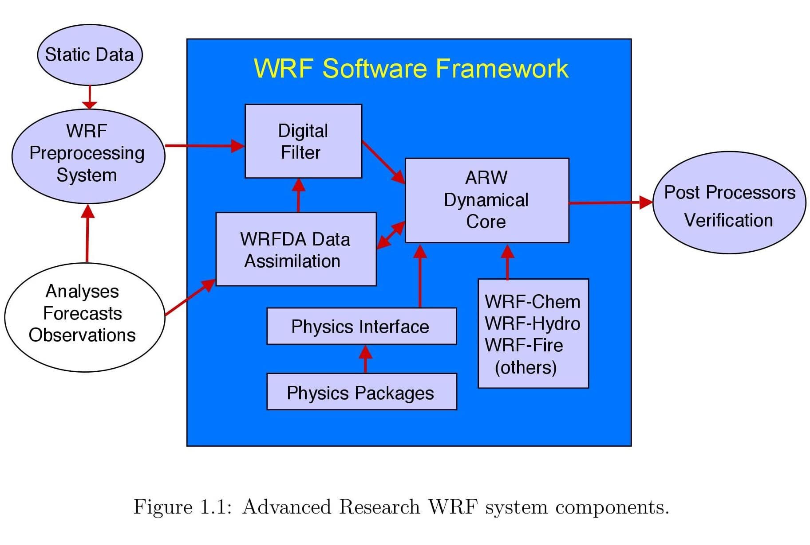

ARW 是 WRF 系统的一套配置，具有 ARW 动力求解器和其他兼容组件，可以进行模拟。因此，它是 WRF 系统的子集，除了特定的求解器之外，还包括物理方案，数值/动力学选项，初始化例程和数据同化包（WRFDA）。

ARW 由灵活的，模块化的，可移植的代码组成，在从笔记本电脑至大规模并行超算的计算环境中都是有效的，并且可以为各种应用轻松配置。它为物理化方案和数值配置提供了大量的选项菜单，反映了社区贡献的历史，使其成为功能强大的数值天气预报 (NWP) 工具。

WRFDA 提供了多种数据同化方法，可以同化各种各样的观察类型。此外，对于除基础天气预报以外的地球系统预测需求，ARW 支持许多量身定制的功能，包括 WRF-Chem（大气化学），WRF-Hydro（水文模式）和 WRF-Fire（荒地火灾模式）。

ARW 作为一个社区模式而被支持，促进系统开发以及被广泛用于研究，运营和教育。它支持从大涡到全球范围的大气模拟。ARW 的应用包括实时数值天气预报(NWP)，天气事件和大气过程研究，数据同化开发，物理参数化开发，区域气候模拟，空气质量建模，大气-海洋耦合以及理想化大气研究。

图1.1描述了 ARW 系统的主要组成部分。WRF 软件框架（WSF）是包含动力学求解器，物理程序包，用于初始化的实用程序，WRFDA 和集成功能（例如 WRF-Chem，WRF-Hydro，WRF-Fire 等）的基础结构。 WSF 还包含 NMM-E 动态求解器，NCEP 在 HWRF 模式中有所使用。NCAR 的中尺度和小尺度气象实验室为 ARW 提供支持，并维护 WRF 版本库以及发布。

本技术说明重点介绍 ARW 第4版中的科学和计算方法，包括其动力求解器，物理方案，初始化功能，边界条件和网格嵌套技术。尽管 WSF 提供了软件基础结构，但本技术说明中未对此基础结构进行说明。此外，尽管 WRF-Chem，WRF-Hydro，WRF-Fire 和其他定制系统使用了 ARW 求解器，但本技术说明也未涵盖它们。有关实际运行 ARW 系统的更多信息，请查阅涵盖了模式操作的《ARWV4 模式系统用户指南》  
(<http://www2.mmm.ucar.edu/wrf/users/docs/user_guide_V4/WRFUsersGuide.pdf>)。

以下部分重点介绍了 ARW 第4版的主要功能，该版本于2018年5月首次发布。
