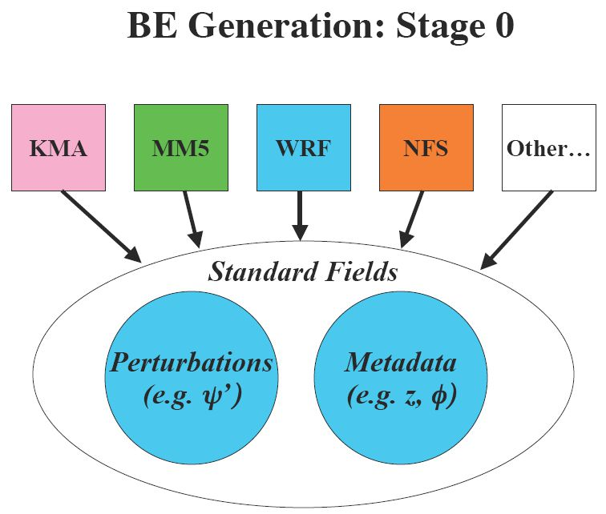

[[toc]]

预测（“首次估计”或“背景”）误差协方差是变分数据同化系统的重要输入。
它们影响分析与观察的契合度，也完全定义了远离观察的分析响应。
后者的影响在全球数据稀疏的地区尤其重要。
与集成滤波器数据同化技术（例如，集合调整卡尔曼滤波器，集合变换卡尔曼滤波器）不同，3/4D-Var 系统不会实时显式地生成预测误差协方差（尽管 4D-Var 和混合变分/集合 WRFDA 目前正在开发的数据同化技术隐含实现了与流相关的协方差。
相反，气候统计数据通常是离线估算的。 
常用的方法是 “NMC-method”，其中使用预测偏差（例如 T+48 减去 T+24）统计量来近似预测误差协方差（Parrish 和 Derber，1992年）。
ECMWF 的实验（Fisher，2003 年）表明，可以使用基于扰动观测/物理学的循环分析/预测集合预报系统获得更好的统计数据。

最近的进展允许通过例如网格转换（Desroziers，1997），各向异性递归滤波器（Wu 等，2002； Purser 等，2003）在 3D/4D-Var 中使用与流相关的预测误差协方差，或变分问题的观测空间公式（Daley 和 Barker，2001）。
通过使用预测模型在 4D-Var 的时间窗口内为不断变化的预测状态提供动态一致性，可以增强 4D-Var 中的流相关性（Rabier 等，1998）。
尽管如此，在 3/4D-Var 中指定和实现与流相关的误差协方差所需的实际工作仍然很重要。

统一的全球/区域 WRFDA 系统的开发及其在 WRF 社区中的广泛使用，需要开发高效，可移植的预测背景误差协方差计算代码。
许多应用程序还表明，如果人们花大力气计算特定于域的误差协方差，而不是使用 WRFDA 版本提供的默认统计信息，则可以获得更好的结果。
在本节中，描述了由 NCAR/MMM 开发的 *gen_be_code*，用于生成与 WRFDA 系统一起使用的预测错误统计信息。

背景误差协方差矩阵定义为

$$
B = \overline{\epsilon \epsilon^T} \simeq \overline{x'x'^T} \tag{11.3}
$$

其中，横线表示时间和/或地理区域的平均值。
真实的背景误差 $\epsilon$ 实际上未知，但被假定为在模型状态扰动 $x'$ 上可以很好地表示。

在标准 NMC 方法（Parrish and Derber，1992）中，扰动 $x'$ 由同时验证的两个预测（例如 24 小时减去 12 小时）之间的差给出。
然后可以通过对一段时间（例如一个月）内的这种预测差异求平均来获得背景误差的气候学估计。
（Fisher，2003）提出的另一种策略是利用集合预测输出，将 $x'$ 向量定义为集合扰动（集合减去集合均值）。
无论采用哪种方法，最终结果都是模型扰动矢量的集合，可以从中得出背景误差的估计值。
*gen_be* 实用程序旨在与预测偏差或基于集合的扰动一起使用。
使用 NMC 方法，$x'=x_{T2}-x_{T1}$，其中 $T2$ 和 $T1$ 是预测差异时间（例如，全球 48h 减去 24h，区域 24h 减去 12h）。
替代地，对于基于集合的方法，$x_k' = x_k - \bar{x}$，其中，上标是集合成员 $k=1，n_e$ 的平均值。
此阶段产生的二进制文件总数为 $n_f \times n_e$，其中 $n_f$ 是使用的预测次数（例如，对于 30 天，每 12 小时进行一次预测，$n_f = 60$）。
使用 NMC 方法，$n_e=1$（每时间1个预测差异）。
对于基于集合的统计，$n_e$ 是集合成员的数量。

如上所述，不是在模型空间 $x'$ 中而是在控制变量空间 $v$ 中指定 WRFDA 背景误差协方差，该变量通过（11.2）中定义的控制变量变换与模型变量（例如风分量，温度，湿度和表面压力）相关。

WRFDA 中同时要求（11.2）及其依赖。
为此，（离线）背景误差工具用于计算在 $U$ 变换中的预测误差协方差矩阵的分量。

以下小节将介绍此过程。

背景误差协方差生成代码 $gen_be$ 被设计为处理来自各种区域/全局模型（例如 ARW，MM5，KMA 全局模型，NFS 等）的数据，并对其进行处理以提供误差协方差统计数据以供变异数据同化系统使用。

初始的，与模型相关的“阶段 0” 如图 11.2 所示。

图 11.2：阶段 0 转换器在将特定于模型的数据（例如 ARW，KMA 全局模型等）转换为标准扰动字段和相关元数据（例如纬度，高度，陆地/海洋等）中的作用示意图。
